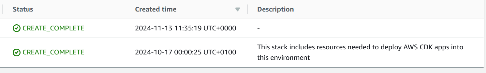
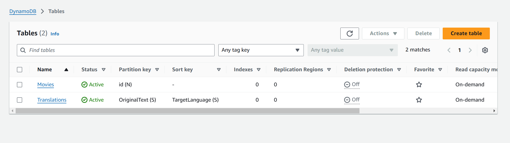
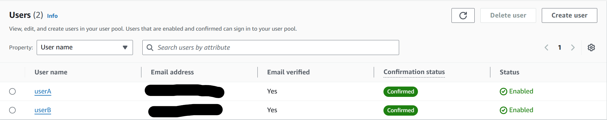

## Serverless REST Assignment - Distributed Systems.

__Name:__ Evan Geary

__Demo:__ https://youtu.be/fHDrG3pIUis

### Context.

The context I chose for this assignment/API is movie details data. The database stores each attribute about the movie as shown below:

+ Title: The title of a movie.
+ Overview: A summary of what the movie is about, including the plot and actors.
+ ID: This is a unique ID attached to each movie, for storage and retrieval purposes
+ Original Language: This stored attributes such as "tl" or "en". Also used for the translate feature
+ Genre ID's: This was used to group like movies with like.

### App API endpoints.

[ Provide a bullet-point list of the app's endpoints (excluding the Auth API) you have successfully implemented. ]
e.g.
 
+ GET /movies
+ GET /movies/(movieId)
+ POST /movies
+ DELETE /movies/(movieId)
+ PUT /movies/(movieId)
+ GET /dev/movies/(movieId)/translate?language=es

### Update constraint (if relevant).

For this assignment only authenticated members are able to update a movie. Once authenticated, any member can update any movie, there is no restriction to what movie an individual can update, only that they have to be authenticated with the "site".

###  Extra/Images

Here we can see the above stack created and its creation time

Here we can see both databases

Here we can see users who have successfully authenticated, hiding their email's for privacy
